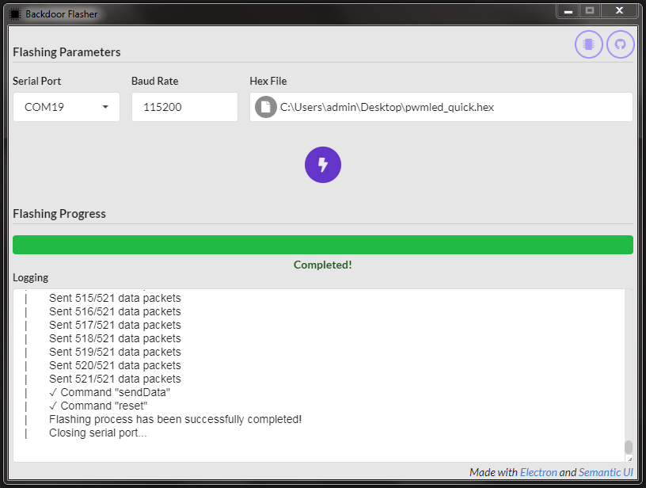

# Description

**Backdoor Flasher** is a GUI tool for flashing the CC26x0 and CC13x0 TI's devices which include ROM-based bootloader that can communicate with an external device over the UART serial interface. The flashing process is explained in their technical reference manual which can be found [here](http://www.ti.com/lit/ug/swcu117h/swcu117h.pdf#%5B%7B%22num%22%3A268%2C%22gen%22%3A0%7D%2C%7B%22name%22%3A%22XYZ%22%7D%2C0%2C717.9%2C0%5D). The tool is made with [Electron](https://electronjs.org/) where its Main Process uses [Node.js](https://nodejs.org/en/) and its Renderer Process uses [Semantic UI](https://semantic-ui.com/).

# Preparation

At this moment this tool can be deployed successfully **only on Windows platforms**. If you just want to use it directly, then just download it from the [releases](https://github.com/arisoik/backdoor_flasher/releases). But if you want to make a development environment for running and building it you need to follow the next steps:

1. Install the latest LTS version of Node.js and npm
2. Install the latest version of Python 2.7 (*not Python 3.x.x*)
3. Install the "Visual C++ build tools" workload from [Visual Studio Build Tools 2017](https://visualstudio.microsoft.com/thank-you-downloading-visual-studio/?sku=BuildTools&rel=15)
4. Download this repository on your machine and through the terminal navigate to its root path
5. To install its dependencies type `npm install`
6. Then to run the application type `npm start`
7. Or to build a portable executable type `npm run build`

***Note:*** The repository also includes the .vscode folder with the launch file for running and debugging the app in Visual Studio Code IDE

# Usage

In order to use this tool you need to follow the next steps:

1. Connect a Usb-to-Serial Converter to the UART pins of the chip (*3.3V device*)
2. If the chip does not contain a valid image or it is empty, then power it up without worrying about the Bootloader's Backdoor pin, it boots directly to the bootloader mode
3. If the chip contains a valid image, then this image must have configured the Bootloader's Backdoor parameters `CCFG BOOTLOADER_ENABLE`, `CCFG BL_PIN_NO` and `CCFG BL_LEVEL` as the manual describes
4. Set (*if step 3 or not if step 2*) the Backdoor pin to the appropriate level and power up the chip. While the chip is powered and is in bootloader mode, set the Backdoor pin to its opposite level (*remove it*) and open the tool
5. In the tool set the port of your Usb-to-Serial Converter, set the baud rate parameter and load a valid for the chip .hex file with Intel's format
6. When everything is set up, click the flash button to begin the flashing process and if everything goes well then you should see the following

  

# In mind/Contributing

- Cross-platform implementation
- Responsive GUI design
- Integration of other MCUs that have UART flashing capability